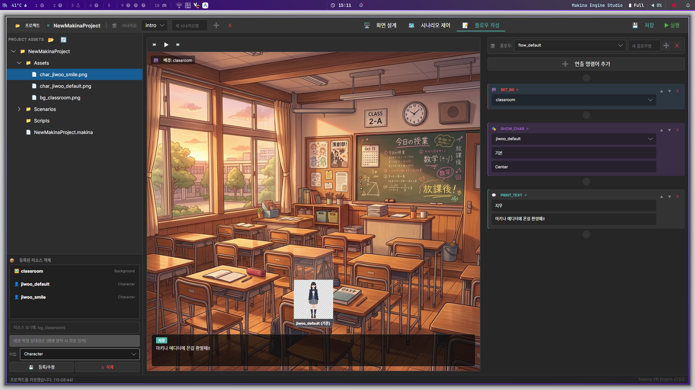

# MakinaEditor

C#과 Avalonia로 개발하는 비주얼노벨 저작 도구입니다. 시나리오 분기와 개별 장면의 연출을 분리해 편집하고, 화면을 미리 확인하는 작업 흐름을 목표로 합니다.

| 항목 | 내용 |
| --- | --- |
| 개발 기간 | 2026.04 - 진행 중 |
| 개발 형태 | 개인 프로젝트 |
| 담당 | 데이터 모델, 편집 구조, UI 및 기능 구현 |
| 기술 | C#, .NET 10, Avalonia 12.0.1, ReactiveUI.Avalonia 12.0.1, System.Text.Json |
| 상태 | 편집기 프로토타입. 게임 실행 런타임·빌드 파이프라인은 미완성입니다. |



## 현재 코드에 구현된 범위

| 영역 | 구현 범위 |
| --- | --- |
| 명령 데이터 | 대사, 배경, 캐릭터, BGM, 셰이더, 입력 대기의 6종 `FlowCommand` |
| 노드 그래프 | 노드 생성·이동·연결, Flow와 시나리오 연결을 편집하는 구조 |
| 플로우 편집 | 명령 목록 편집과 실행 취소·재실행 |
| 저장 데이터 | `$type` 식별자를 사용하는 JSON 다형성 직렬화 |
| 프리뷰 | 배경·캐릭터 이미지 및 대사 상태 반영, 비트맵 캐시 |
| 프로젝트 관리 | 프로젝트·시나리오·에셋을 분리하는 ViewModel 구조 |

현재 프리뷰의 BGM·셰이더 처리는 관련 상태 표시까지 구현되어 있습니다. 실제 오디오 재생과 셰이더 실행은 이후 런타임 연동 단계에서 다룰 예정입니다.

## 데이터와 편집 구조

### 시나리오 흐름과 장면 연출 분리

시나리오 단위의 분기·흐름을 담당하는 계층과, 대사·이미지 등의 연출 명령 계층을 나눕니다. 코드에서는 이 계층을 구분하기 위해 `Kernel`·`UserFlow`라는 내부 명칭을 사용합니다.

| 구성 | 책임 |
| --- | --- |
| `Models/` | 프로젝트, 시나리오, 리소스, 명령 데이터 |
| `ViewModels/` | 프로젝트 관리, 그래프·타임라인 편집, 프리뷰 상태 |
| `Views/` | Avalonia AXAML 화면과 입력 처리 |
| `Services/` | 에셋 관리와 Undo/Redo |
| `Core/` | Opcode 열거형과 편집 동작 인터페이스 |

### 편집 동작의 Undo/Redo

[UndoRedoService](Services/UndoRedoService.cs)는 `IUndoableAction`의 `Execute`·`Undo`를 호출하고, 두 개의 스택으로 이력을 관리합니다. 새 동작을 실행하면 Redo 이력을 비웁니다. 편집 동작은 [FlowEditorActions](ViewModels/FlowEditorActions.cs)에 분리했습니다.

현재 Undo/Redo는 주로 플로우 편집에 적용되어 있습니다. 그래프와 프로젝트 변경으로의 적용 확대는 다음 단계입니다.

### 명령 직렬화와 프리뷰

[Commands](Models/Commands.cs)에서 명령별 타입과 속성을 정의하고, `JsonPolymorphic`·`JsonDerivedType`으로 저장 타입을 구분합니다. [PreviewViewModel](ViewModels/PreviewViewModel.cs)은 선택한 위치까지의 명령을 반영해 프리뷰 상태를 구성합니다.

별도의 프리뷰 상태를 편집 데이터와 이중으로 저장하지 않고, 선택 지점까지 명령을 다시 적용해 표시 상태를 구성하도록 했습니다. 편집 데이터와 미리보기 상태의 동기화 지점을 줄이고, 특정 위치의 결과를 같은 명령 데이터에서 재구성하기 위한 선택입니다.

이미지 객체는 캐시하고 캐시 정리 시 `Dispose`합니다.

## 실행 준비

[프로젝트 파일](MakinaEditor.csproj)의 대상 프레임워크는 `net10.0`입니다. .NET 10 SDK와 데스크톱 GUI 실행 환경이 필요합니다. 저장소를 내려받을 수 있는 환경에서 다음을 실행합니다.

```bash
git clone https://github.com/REndPaper/MakinaEditor.git
cd MakinaEditor
dotnet restore MakinaEditor.csproj
dotnet run --project MakinaEditor.csproj
```

Avalonia 기반이지만 각 OS에서의 동작 검증·배포를 모두 완료한 것은 아닙니다.

## 첫 편집 흐름

이미지 없이 대사 명령부터 확인하면 편집 흐름을 빠르게 살펴볼 수 있습니다.

1. 시작 화면의 **새 프로젝트 생성**에서 이름과 저장 위치를 지정합니다. 기존 작업은 **프로젝트 폴더 열기**로 엽니다.
2. 상단에서 시나리오를 선택합니다. 새 시나리오가 필요하면 **새 시나리오명**을 입력하고 옆의 `+`를 누릅니다.
3. **플로우 작성** 탭에서 플로우를 선택합니다. 목록이 비어 있으면 **새 플로우명**을 입력하고 옆의 `+`로 생성합니다.
4. **연출 명령어 추가 → 대사 출력 추가**를 선택해 화자와 대사를 편집합니다.
5. 명령을 선택하고 중앙 프리뷰에서 결과를 확인합니다. 이전·다음 연출 버튼으로 확인 위치를 바꿀 수 있습니다.
6. 명령 추가·삭제 등의 편집 동작을 `Ctrl+Z`와 `Ctrl+Y`로 되돌리거나 다시 적용합니다. 상단 **저장**을 눌러 프로젝트와 시나리오를 저장합니다.

배경·캐릭터 이미지를 확인하려면 프로젝트 에셋을 등록한 뒤 해당 연출 명령에 지정합니다. 프리뷰 재생과 게임 빌드는 별개입니다. 상단 **실행** 버튼의 게임 실행·컴파일 기능은 아직 개발 중이며, 현재는 편집과 프리뷰를 확인하는 단계입니다.

## 다음 단계

- 프로젝트 및 시나리오 데이터 검증, 오류 메시지와 복구 흐름 보강
- 그래프 편집 등으로 Undo/Redo 적용 범위 확대
- 조건식과 연결 관계의 유효성 검증
- 실제 런타임 연동 및 빌드·내보내기
- 사용자 플러그인 인터페이스 설계와 구현

플러그인·C++ 런타임·WYSIWYG UI 편집은 계획 단계입니다.

## AI 개발 보조 도구 활용

전체 구조와 요구사항은 직접 정하고, 여러 기능을 구현하는 과정에서 Codex를 폭넓게 활용했습니다. 생성된 코드는 설계 의도와 맞는지 검토하고 실제 실행 결과를 확인하며 수정했습니다. 설계 판단과 결과 검증은 개발자가 담당합니다.

## 공개 및 라이선스

이 프로젝트는 독점 라이선스 하에 있습니다. 허가 없는 코드·에셋의 복제 및 배포를 허용하지 않습니다. 저장소 공개 여부와 재사용 허가는 별개이며, 의존 라이브러리의 라이선스는 각각의 조건을 따릅니다.
